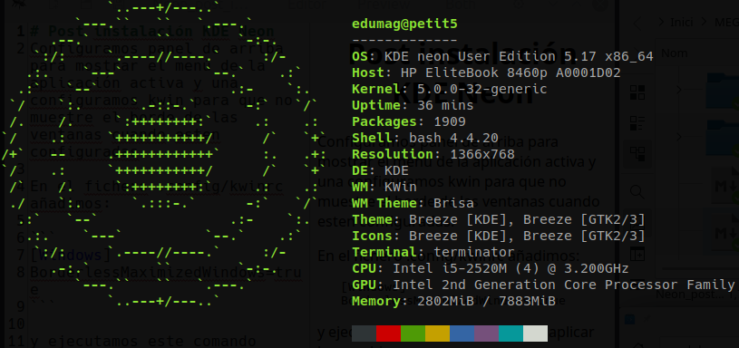

# Post instalación KDE Neon 5.17



## Apariencia.

Configuramos panel de arriba para mostrar el menú de la aplicación activa y una
configuramos kwin para que no muestre el borde de las ventanas cuando esten
configuradas.

En el fichero .config/kwinrc añadimos:

```
[Windows]
BorderlessMaximizedWindows=true
```

y ejecutamos este comando para aplicar los cambios:

```
qdbus org.kde.KWin /KWin reconfigure
```

## Aplicaciones básicas.

Instalación de programas:

```
sudo apt-get install thunderbird         # Correo.
sudo apt-get install xul-ext-lightning   # Calendario.
sudo apt-get install terminator          # Terminal
sudo apt-get install htop                # Monitor del sistema.
sudo apt-get install ffmpegthumbs        # Miniaturas de vídeo.
sudo apt-get install ffmpegthumbs        # Miniaturas de vídeo.
sudo apt install kubuntu-driver-manager  # Controladores privativos.
```

### Libreoffice

```
sudo apt install libreoffice libreoffice-l10n-ca  hunspell-ca hunspell-es
```
### Rambox (Whatsapp, telegram, ...)

https://github.com/ramboxapp/community-edition/releases/tag/0.6.9

## Desarrollo.

### Docker.

#### Añadimos repositorio para docker en /etc/apt/sorce.list.

```
deb [arch=amd64] https://download.docker.com/linux/ubuntu/ bionic stable
```

#### Desinstalamos versión antigua.

```
sudo apt-get remove docker docker-compose
```

#### Instalamos desde nuevo repositorio.

```
sudo apt-get install docker-ce docker-ce-cli containerd.io
```

#### Instalamos última version de docker-compose:

```
sudo curl -L "https://github.com/docker/compose/releases/download/1.24.1/docker-compose-$(uname -s)-$(uname -m)" -o /usr/local/bin/docker-compose
sudo chmod +x /usr/local/bin/docker-compose
```

#### Añadimos nuestro usuario al grupo docker.

```
sudo usermod -aG docker $USER
```

### MariaDB

Instalamos:

sudo apt install mariadb-client mariadb-server

#### Configuramos usuario root.

Para que pueda utilizar el cliente de consola sin pedir contraseña.

Entramos en mysql:

```
sudo mysql

```

Desde mysql:

```
use mysql;
update user set plugin='' where user='root';
flush privileges;
```

Configuramos mediante el fichero ~/.my.cnf

```
[client]
user=root
password=PASWORD_ROOT
```


