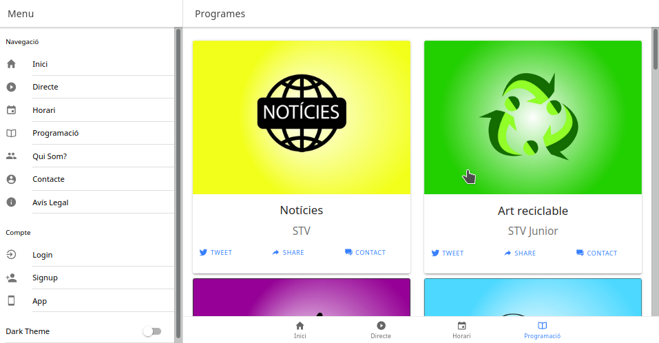
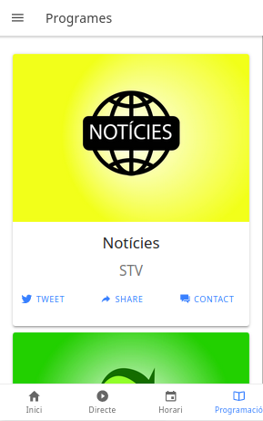

# Preparar entorno desarrollo con ionic4 en KDE Neon (ubuntu 18.04)

Ejemplo de aplicación creada con ionic desde ubuntu o en mi caso derivada.

Instalamos node, android studio, ioinc y subimos a nuestro servidor con [dokku](https://lesolivex.com/?s=dokku).



Formato web



Formato movil


## Instalación

### Limpieza

```bash
sudo apt-get purge –auto-remove nodejs
sudo rm -rf /usr/local/bin/npm /usr/local/share/man/man1/node* /usr/local/lib/dtrace/node.d ~/.npm ~/.node-gyp /opt/local/bin/node /opt/local/include/node /opt/local/lib/node_modules
sudo rm -rf /usr/local/lib/node*
sudo rm -rf /usr/local/include/node*
sudo rm -rf /usr/local/bin/node*
```

### NVM y NodeJS

```bash
sudo apt install build-essential libssl-dev
wget -qO- https://raw.githubusercontent.com/nvm-sh/nvm/v0.35.2/install.sh | bash
source .bashrc
# Buscamos la última release.
nvm ls-remote
# Instalamos.
nvm install v12.14.0
npm install -g cordova
sudo apt update
sudo apt install libc6:i386 libncurses5:i386 libstdc++6:i386 lib32z1 libbz2-1.0:i386
npm install -g ionic
```

### Android studio.

Bajamos de https://developer.android.com/studio/

```bash
sudo mv android-studio-ide-*-linux.zip /opt/
cd /opt/
sudo unzip /opt/android-studio-ide-*-linux.zip
sudo chown -R $USER:$USER android-studio
./bin/studio.sh  (ignore if you want to create a shortcut, you’ll need it)
sudo ln -sf /opt/android-studio/bin/studio.sh /bin/android-studio
sudo nano /usr/share/applications/android-studio.desktop

[Desktop Entry]
Version=1.0
Type=Application
Name=Android Studio 3.1.3
Comment=Android Studio
Exec=bash -i "/opt/android-studio/bin/studio.sh" %f
Icon=/opt/android-studio/bin/studio.png
Categories=Development;IDE;
Terminal=false
StartupNotify=true
StartupWMClass=jetbrains-android-studio
Name[en_GB]=android-studio.desktop

Install Android SDK, ‘platform-tools’ and ‘tools’
Add Android and SDK paths to your bash profile
# Set Android_HOME
export ANDROID_HOME=~/Android/Sdk
# Add the Android SDK to the ANDROID_HOME variable
export PATH=$ANDROID_HOME/platform-tools:$PATH
export PATH=$ANDROID_HOME/tools:$PATH
Install Gradle build tool, with SKDMAN
curl -s “https://get.sdkman.io&#8221; | bash
source “$HOME/.sdkman/bin/sdkman-init.sh”
```

### Referencias

- [Artículo de javascriptsurvival](https://javascriptsurvival.wordpress.com/2018/08/12/install-ionic-cordova-with-android-development-environment-for-ubuntu-18-04/)

## Aplicación con capacitor y react


Ejemplo:

```bash
ionic start TUAPLICACION tabs --capacitor
```

Seleccionamos react como tipo de proyecto.

```bash
cd TUAPLICACION
```

Iniciamos servidor de ionic.

```bash
ionic serve
```

Activar capacitor.

```bash
npx cap init TUAPLICACION TUAPLICACION.com
ionic build
```

En mi caso no creo el directorio www con lo cual no pude añadir la plataforma
para android.

Para corregir esto modificamos el fichero capacitor.config.json cambiando la
linea que especifica la carpeta.

```
"webDir": "public"
```

y en el fichero package.json añadimos una nueva linea.

```
"scripts": {
    "start": "react-scripts start",
    "build": "react-scripts build",
    "test": "react-scripts test",
    "eject": "react-scripts eject",
    "ionic:build": "npm run build && ionic capacitor copy android" # Nueva linea
  },
```

Volvemos a ejecutar "ionic build".

Y tendremos tanto la carpeta public como la de android.

Finalmente volvemos a cambiar el fichero "capacitor.config.json" y cambiamos
"public" por "build".

Ahora ya podemos abrir la carpeta android con android-studio y crear nuestra
app.

#### Referencia

- [Solución al error con build, medium.com](https://medium.com/javascript-in-plain-english/ionic-react-one-app-that-runs-everywhere-7a36dc682c1c)

### Trabajando

#### Actualizar cambios.

```
ionic build
# Copiar cambios a las diferentes plataformas.
npx cap copy
# Sincronizar cambios.
npx cap update
```


### Subir a dokku

Añadimos información al package.json para dokku.

```
  "engines": {
    "node": "^12.7.5",
    "npm": ">= 6.13.4"
  },
```

Desde dokku:

```
dokku apps:create TUAPLICACION
dokku domains:add TUAPLICACION TUAPLICACION.TUSERVIDOR.com
```

Añadimos repositorio de dokku.

```
git remote add dokku dokku@TUSERVIDOR.com:TUAPLICACION
```

#### Referencias.

- [albertgao.xyz](http://www.albertgao.xyz/2019/01/28/how-to-setup-your-own-paas-with-dokku-node-react-mongodb-nginx/)

### Referencias

- [Capacitor: La nueva forma de construir apps nativas con Ionic, de nicobytes](https://www.youtube.com/watch?v=MTuttuME414)

- [Documentación oficial de capacitor](https://capacitor.ionicframework.com/docs/getting-started/with-ionic)

- [Documentaciónoficial de ionic]( https://ionicframework.com/docs/building/starting)
