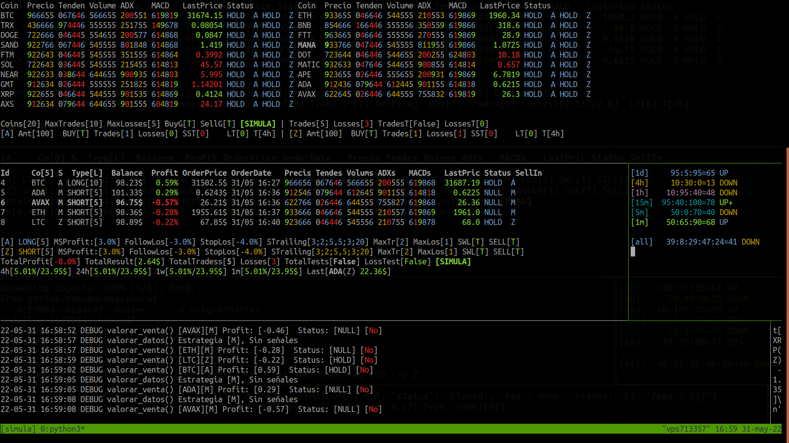

# EMMA

Os presentamos al proyecto EMMA de código abierto.

Un desarrollo creado en python para facilitar el traiding en cualquier exchange soportado por la librería ccxt.

De momento ha sido probado con binance y kraken.

En este enlace tenéis el [código fuente](https://gitlab.com/edumag/emma).

La idea principal es tener una herramienta que pueda tomar decisiones por nosotros en caso necesario.

El desarrollo esta en fase beta no se recomienda utilizar en modo real sin supervisar.

Para poder testear tenemos el modo simulado que simplemente no genera ordenes en
el exchange o bien podemos configurar la testnet como exchange.

Podemos ejecutar la aplicación en nuestro ordenador o en un servidor, en la
carpeta de scripts tenemos un par de de ellos que ejecutan la aplicación en el
servidor mediante tmux, solo es necesario tener bien configurado el servidor
para aceptar peticiones ssh sin contraseña.

También podremos comunicarnos mediante telegram creando un bot especifico para
ello y añadiendo las claves en la configuración.

El sistema de estrategias nos permite automatizar las operaciones con el
peligro que eso conlleva.

No es nada recomendable sin tener muy claro lo que se hace, ya que lo que
funciona un día al siguiente ya no sirve, pero si que es muy útil para
programar el cierre cuando se den ciertas circunstancias o con el stoptrailing.

El código está muy verde en muchos aspectos, así que si alguien se anima a
mejorar o ampliar las funcionalidades sera bien venido.

-------

Desarrollo en python basado en la librería [ccxt](https://github.com/ccxt/ccxt).

Nos permite gestionar de forma ágil nuestras operaciones en los diferentes exchanges.

**Advertencia**

Este proyecto esta en fase de desarrollo, no se recomienda utilizar en modo real.

## Funcionalidades

Nos permite tener una visión general del mercado de criptomonedas, mostrándonos el estado de los precios, la tendencia, el volumen el ADX y el MACD en cinco de las temporalidades que escojamos.

Establecer diferentes stoptrailing por cada operación o por estrategia.

Establecer stoploss por cada operación o estrategia.

Configurar diferentes estrategias para diferentes temporalidades. ([Ver estrategias](./docs/estrategias.md))

Modo Real y modo SIMULA para pruebas.

Comunicación con telegram. (Avisos y envío de ordenes)

Scripts que permiten abrir una terminal con tmux en un servidor.

## Install

### App

git clone git@gitlab.com:edumag/emma.git
cd emma
pip install -r requirements.txt

### Generate database

./scripts/init_db

### Configuración

cp env.example .env

Editar fichero .env y adaptarlo con vuestros datos.

### Estrategias

Importar estrategias.

./src/strategies.py -i all

## Configure

 ./src/db.py -cfg estrategias_activadas:A_Z
