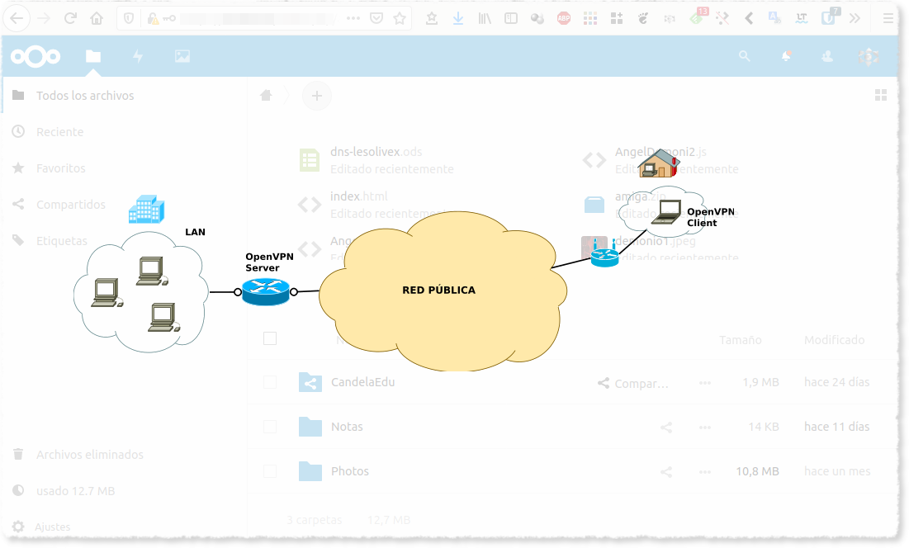

# NextCloud VPN VPS


 

Instalamos un nextcloud en la computadora de casa pero al estar dentro de guifiNet no tengo acceso desde internet.

En caso de tener un router con salida a internet directamente hay una solución
mucho más sencilla que es con noip, podeis buscar que hay mucha información.

La solución que he encontrado ha sido instalar una VPN en el VPS que tengo contratado con OVH.

Estos son los pasos a seguir.

## Instalación de NextCloud

Para lainstalación de nexclous solo hay que seguir este excelente tutorial.

https://www.digitalocean.com/community/tutorials/como-instalar-y-configurar-nextcloud-en-ubuntu-18-04-es

### Varios

#### Forzar a nextcloud a reescanear en busca de nuevos ficheros

sudo nextcloud.occ files:scan --all

#### Ampliar los dominios permitidos a nextcloud

Puede ver los ajustes actuales consultando el valor de la matriz trusted_domains:

`sudo nextcloud.occ config:system:get trusted_domains`

Añadimos un nuevo dominio.

`sudo nextcloud.occ config:system:set trusted_domains 1 --value=example.com`

## OpenVPN

### Desde el servidor:

#### Instalamos openvpn

Esta es la forma más sencilla que he encontrado.

```
wget https://raw.githubusercontent.com/theonemule/simple-openvpn-server/master/openvpn.sh
chmod +x openvpn.sh
./openvpn.sh --adminpassword=[Contraseña admin] --host=vpn.[tu dominio].com
```

En mi caso he tenido que realizar unos cambios para poder tener conexión
al ordenador de casa.

#### Configuración openvpn


`sudo vim /etc/openvpn/server.conf`

```
port 1194
proto udp
dev tun
sndbuf 0
rcvbuf 0
ca ca.crt
cert server.crt
key server.key
dh dh.pem
tls-auth ta.key 0
topology subnet
server 10.8.0.0 255.255.255.0
client-to-client
ifconfig-pool-persist ipp.txt
push "redirect-gateway def1 bypass-dhcp"
push "dhcp-option DNS 8.8.8.8"
push "dhcp-option DNS 8.8.4.4"
keepalive 10 120
cipher AES-256-CBC
user nobody
group nogroup
persist-key
persist-tun
status openvpn-status.log
verb 3
crl-verify crl.pem
client-config-dir ccd
explicit-exit-notify 1
```
#### Firewall

`sudo vim /etc/ufw/before.rules`

```
# START OPENVPN RULES
# NAT table rules
*nat
:POSTROUTING ACCEPT [0:0] 
# Allow traffic from OpenVPN client to [ens3] (change to the interface you discovered!)
-A POSTROUTING -s 10.8.0.0/8 -o ens3 -j MASQUERADE
COMMIT
# END OPENVPN RULES
```

En tu caso tendrás que poner la interface que te corresponde.

Puedes verla con `ip route | grep default`

`sudo vim /etc/default/ufw`

Modificar valor:

`DEFAULT_FORWARD_POLICY="ACCEPT"`

#### Sistema

`sudo vim sudo nano /etc/sysctl.conf`

```
net.ipv4.ip_forward=1
```

Reiniciar configuración.

`sudo sysctl -p`

#### Conprobación.

ip a s tun0

```
14: tun0: <POINTOPOINT,MULTICAST,NOARP,UP,LOWER_UP> mtu 1500 qdisc fq_codel state UNKNOWN group default qlen 100
    link/none 
    inet 10.8.0.100 peer 255.255.255.0/32 scope global tun0
       valid_lft forever preferred_lft forever
    inet6 fe80::f2c0:df16:b35d:ae30/64 scope link stable-privacy 
       valid_lft forever preferred_lft forever
```

#### Crear fcihero de configuración para el cliente.

Creamos un nuevo cliente desde el administrador web que nos proporciona el script.

### Desde el cliente.

`sudo apt-get install openvpn`

Movemos el fichero de configuración que hemos creado a:

`/etc/openvpn/client.conf`

`sudo systemctl enable openvpn@client.service`

### Referencias

- https://github.com/theonemule/simple-openvpn-server/
- https://www.digitalocean.com/community/tutorials/como-configurar-un-servidor-de-openvpn-en-ubuntu-18-04-es


## SSHL

En este punto tenemos que poder conectar con el cliente desde el servidor.

Para comprobarlo:

Desde el servidor.

`sudo apt-get install links`

`links https://10.8.0.2`

__IMG__ 

Las conexciones al puerto 9999 de la VPS las redirigimos al VPN con la IP del cliente.

sslh -p 0.0.0.0:9999 --ssh 10.8.0.2:443

Creamos configuración permanente.

`cat /etc/default/sslh`

```
RUN=yes

# binary to use: forked (sslh) or single-thread (sslh-select) version
# systemd users: don't forget to modify /lib/systemd/system/sslh.service
DAEMON=/usr/sbin/sslh

#DAEMON_OPTS="--user sslh --transparent --listen 0.0.0.0:9999 --ssh 10.8.0.100:443 --pidfile /var/run/sslh/sslh.pid"
DAEMON_OPTS="--user sslh --listen 0.0.0.0:9999 --ssl 10.8.0.2:443 --pidfile /var/run/sslh/sslh.pid"
```

#### Referencias:

- https://www.entredevyops.es/posts/laboratorio-sslh.html

