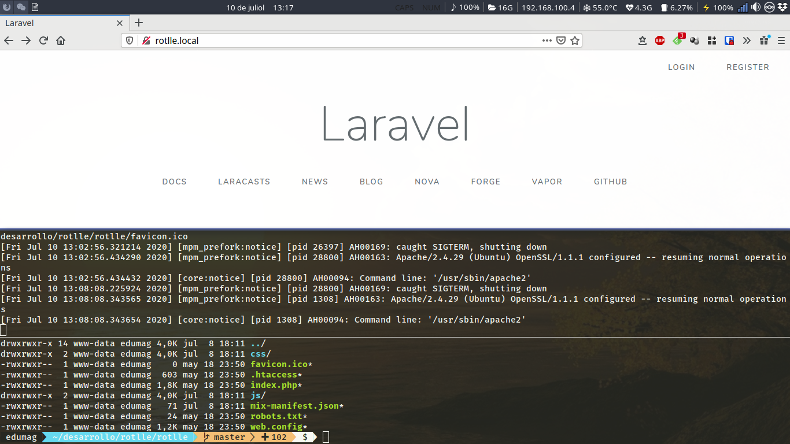

# Crear virtual host en local con apache



## Instalación de apache

```
sudo apt-get install apache2 libapache2-mod-php7.2 php7.2 php7.2-xml php7.2-gd php7.2-opcache php7.2-mbstring
```

Una vez instalado apache

```
sudo a2enmod rewrite
```

## Creamos fichero de configuración

```
cd /etc/apache2/sites-available/
```

### localvirtualhost.conf

```
<VirtualHost *:80>
	ServerName $DOMINIO_LOCAL
	ServerAdmin webmaster@localhost
	ErrorLog ${APACHE_LOG_DIR}/error.log
	CustomLog ${APACHE_LOG_DIR}/access.log combined
	DocumentRoot $DIR_PROYECTO
    <Directory  "$DIR_PROYECTO">
        Options +Indexes +Includes +FollowSymLinks +MultiViews
        AllowOverride All
        Require all granted
    </Directory>
</VirtualHost>

# vim: syntax=apache ts=4 sw=4 sts=4 sr noet
```

## Activamos configuración

```
sudo a2ensite localvirtualhost.conf
sudo systemctl restart apache2
```

## Permisos

```
sudo chgrp -R www-data $DIR_PROYECTO
sudo chmod -R 775 $DIR_PROYECTO/storage
```


