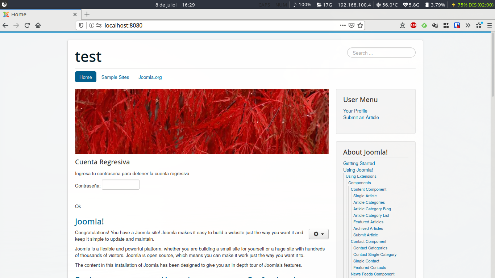

# Instalación local de joomla en 1 minuto con docker





Esta es una de las maravillas de docker.

En un minuto tienes una instancia funcionando y preparada para comenzar a
programar tu nuevo módulo.

## Primer paso

Creamos fichero docker-compose.yml

```
version: '3.1'

services:
  joomla:
    image: joomla
    links:
      - joomladb:mysql
    ports:
      - 8080:80
    volumes:
      - "./www:/var/www/html"
    environment:
      JOOMLA_DB_HOST: joomladb
      JOOMLA_DB_PASSWORD: example

  joomladb:
    image: mysql:5.6
    volumes:
      - "./db:/var/lib/mysql"
    environment:
      MYSQL_ROOT_PASSWORD: example

volumes:
  db:
  www:
```

## Segundo paso

Ejecutamos docker-comnpose-

```
docker-compose up
```

Así de rápido, así de fácil.

Ya podemos ir a http://localhost:8080/ y tenemos nuestro joomla.


