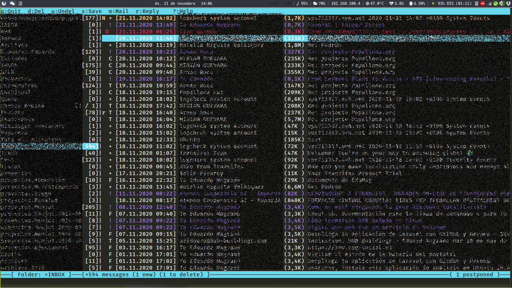

# Mutt

Gestionar correo desde consola.

http://www.mutt.org/



Mutt nos permite administrar nuestro correo desde consola, de esta manera evitamos lanzar aplicaciones que nos consuman mucha memoria.

En la configuración de este proyecto tenemos un ejemplo de mutt funcionando con un correo de gmail y otro cinfugrado con smtp e imap.

## goobook

Gestor de contactos de gmail en la consola que se adapta perfectamente a mutt.

https://pypi.org/project/goobook/

## Instalación y puesta en marcha

```bash
sudo apt-get install mutt goobook
```

### Clonar configuración

```bash
cd .config
git clone https://gitlab.com/edumag/muttstartup.git
mv muttstartup mutt
cd mutt
```

Crear fichero accounts/secrets

```
# vim:ft=muttrc
# First account variables labeled with '_00'.
set my_imap_pass_00  = <PASSWORD>
set my_hostname_00   = "<HOSTNAME_CORREO>"
set my_folder_00     = "imaps://<IMAP_URL>"
set my_from_00       = "<CORREO>"
set my_realname_00   = "<NOMBRE_REAL>"
set my_imap_user_00  = "<IMAP_USER>" # Posiblemente el mismo correo.
set my_spoolfile_00  = imaps://<IMAP_USER>/INBOX
set my_smtp_url_00   = "smtps://<IMAP_USER@<IMAP_URL>:465/"

# Second account the variables are incremented to '_01'.
set my_imap_pass_01 = <PASSWORD>
set my_folder_01    = "imaps://<USER_GMAIL>@imap.gmail.com"
set my_from_01      = "<CORREO_GMAIL>"
set my_realname_01  = "NOMBRE_REAL"
set my_imap_user_01 = "CORREO_GMAIL"
set my_spoolfile_01 = imaps://<USER_GMAIL>@imap.gmail.com/
```

Encriptamos fichero secrets.

En caso de tener una clave gpg podemos crearla con:

    gpg --gen-key

Ahora encriptamos con el correo de la llave generada.

    cd accounts
    gpg --recipient <CORREO_GPG> --encrypt secrets

Borramos fichero con las credenciales.

    rm secrets

Si queremos recuperarlo.

    gpg --decrypt secrets.gpg > secrets

### .bashrc

Arrancamos agente gpg desde ~/.bashrc

```
envfile="$HOME/.gnupg/gpg-agent.env"
if [[ -e "$envfile" ]] && kill -0 $(grep GPG_AGENT_INFO "$envfile" | cut -d: -f 2) 2>/dev/null; then
  eval "$(cat "$envfile")" 2>/dev/null 
else
  eval "$(gpg-agent --daemon --allow-preset-passphrase 2>/dev/null)" 
fi
export GPG_AGENT_INFO
```

### Varios

En ~/.bashrc añado la linea:

    alias mutt="cd ~/Mail ; mutt"

De esta manera cada vez que arrancamos mutt nos sitúa el el directorio que
tenemos configurado en muttrc y en caso de bajar un adjunto lo encontraremos
siempre aquí


## Referencias

- https://nixvsevil.com/posts/mutt-gmail-oauth-gnupg/
- https://www.albertopicado.es/enviar-correo-desde-consola-con-mutt/
