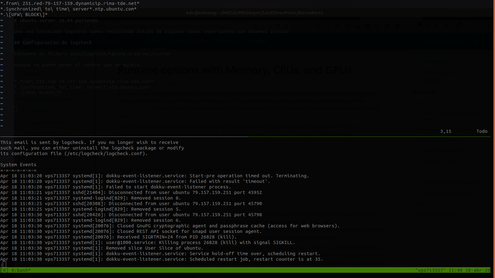

# Afinando ubuntu server 18.04



Una vez instalado logcheck vamos recibiendo avisos de algunas cosas importantes que debemos ajustar y en caso de ser imoprtantes ignorarlas.

## Salida de logcheck

`sudo -u logcheck logcheck -o -t`

```
This email is sent by logcheck. If you no longer wish to receive
such mail, you can either uninstall the logcheck package or modify
its configuration file (/etc/logcheck/logcheck.conf).

Security Events for su
=-=-=-=-=-=-=-=-=-=-=-
Apr 18 10:22:50 [HOSTAME] su[22045]: pam_systemd(su:session): Cannot create session: Already running in a session

System Events
=-=-=-=-=-=-=
Apr 18 10:04:59 [HOSTAME] dockerd[922]: time="2020-04-18T10:04:59.897314633+02:00" level=warning msg="Your kernel does not support swap memory limit"
Apr 18 10:04:59 [HOSTAME] dockerd[922]: time="2020-04-18T10:04:59.897868144+02:00" level=warning msg="Your kernel does not support cgroup rt period"
Apr 18 10:04:59 [HOSTAME] dockerd[922]: time="2020-04-18T10:04:59.897888027+02:00" level=warning msg="Your kernel does not support cgroup rt runtime"
Apr 18 10:04:59 [HOSTAME] dockerd[922]: time="2020-04-18T10:04:59.898400417+02:00" level=info msg="Loading containers: start."
Apr 18 10:04:59 [HOSTAME] systemd-timesyncd[602]: Synchronized to time server 91.189.94.4:123 (ntp.ubuntu.com).
Apr 18 10:04:59 [HOSTAME] kernel: [   20.828934] IPv6: ADDRCONF(NETDEV_UP): docker0: link is not ready
Apr 18 10:04:59 [HOSTAME] dockerd[922]: time="2020-04-18T10:04:59.894540591+02:00" level=info msg="Default bridge (docker0) is assigned with an IP address 172.17.0.0/16. Daemon option --bip can be used to set a preferred IP address"
Apr 18 10:04:59 [HOSTAME] systemd-networkd[706]: docker0: Link UP
Apr 18 10:04:59 [HOSTAME] systemd-timesyncd[602]: Network configuration changed, trying to establish connection.
Apr 18 10:04:59 [HOSTAME] systemd-timesyncd[602]: Synchronized to time server 91.189.94.4:123 (ntp.ubuntu.com).
Apr 18 10:05:00 [HOSTAME] kernel: [   20.565372] bridge: filtering via arp/ip/ip6tables is no longer available by default. Update your scripts to load br_netfilter if you need this.
Apr 18 10:05:00 [HOSTAME] kernel: [   20.718541] Initializing XFRM netlink socket
Apr 18 10:05:00 [HOSTAME] kernel: [   20.728739] Netfilter messages via NETLINK v0.30.
Apr 18 10:05:00 [HOSTAME] kernel: [   20.735211] ctnetlink v0.93: registering with nfnetlink.
Apr 18 10:05:00 [HOSTAME] systemd-udevd[2038]: link_config: autonegotiation is unset or enabled, the speed and duplex are not writable.
Apr 18 10:05:00 [HOSTAME] systemd-timesyncd[602]: Network configuration changed, trying to establish connection.
Apr 18 10:05:00 [HOSTAME] networkd-dispatcher[910]: WARNING:Unknown index 4 seen, reloading interface list
Apr 18 10:05:00 [HOSTAME] systemd-udevd[2166]: link_config: autonegotiation is unset or enabled, the speed and duplex are not writable.
Apr 18 10:05:00 [HOSTAME] kernel: [   21.200548] docker0: port 1(veth9baff38) entered blocking state
Apr 18 10:05:00 [HOSTAME] kernel: [   21.200550] docker0: port 1(veth9baff38) entered disabled state
Apr 18 10:05:00 [HOSTAME] kernel: [   21.200633] device veth9baff38 entered promiscuous mode
Apr 18 10:05:00 [HOSTAME] kernel: [   21.202629] IPv6: ADDRCONF(NETDEV_UP): veth9baff38: link is not ready
Apr 18 10:05:00 [HOSTAME] kernel: [   21.202633] docker0: port 1(veth9baff38) entered blocking state
Apr 18 10:05:00 [HOSTAME] kernel: [   21.202635] docker0: port 1(veth9baff38) entered forwarding state
Apr 18 10:05:00 [HOSTAME] kernel: [   21.202669] docker0: port 1(veth9baff38) entered disabled state
Apr 18 10:05:00 [HOSTAME] systemd-networkd[706]: veth9baff38: Link UP
...
```

## Arreglar problemas

### Your kernel does not support swap memory limit

`sudo vim /etc/default/grub`

Modificamos GRUB_CMDLINE_LINUX

```
GRUB_CMDLINE_LINUX="cgroup_enable=memory swapaccount=1"
```

`sudo update-grub`

`sudo reboot`

### Server returned error NXDOMAIN, mitigating potential DNS violation

```
cd /etc
sudo ln -sf ../run/systemd/resolve/resolv.conf /etc/resolv.conf
```

https://www.linode.com/community/questions/17081/dns-stops-resolving-on-ubuntu-1804

## Configuración de logcheck

Editamos el fichero /etc/logcheck/ignore.d.server/custom

Aunque se puede poner el nombre que se quiera.

```
*.from\ 251.red-79-157-159.dynamicip.rima-tde.net*
*Synchronized\ to\ time\ server*
*.\[UFW\ BLOCK\]*
*filtering\ via\ arp/ip/ip6tables\ is\ no\ longer\ available*
*Initializing\ XFRM\ netlink\ socket*
*Netfilter\ messages\ via\ NETLINK*
*ctnetlink\ v0.93:\ registering\ with\ nfnetlink.*
*systemd-udevd*
*networkd-dispatcher*
*systemd-networkd*
*IPv6:* 
*Link\ UP*
*entered\ promiscuous\ mode*
*entered\ blocking\ state*
*can\ be\ used\ to\ set\ a\ preferred\ IP\ address*
*Network\ configuration\ changed*
*docker0*
*eth0*
*snapd*
*containerd*
*ovpn-server.*peer\ info*
*ovpn-server.*VERIFY\ OK*
*ovpn-server.*Initial\ packet*
*ovpn-server.*Connection\ Initiated*
*ovpn-server.*Control\ Channel*
```


`*.from\ 251.red-79-157-159.dynamicip.rima-tde.net*`

Evitamos que nos avise ya que se trata de nuestros clientes de nextcloud intentando conectar cuando esta el ordenador de casa apagado.

`*.Synchronized\ to\ time\ server*.ntp.ubuntu.com*`

Servidor actualizando la hora del sistema.

`*.\[UFW\ BLOCK\]*`

Ips bloqueadas, son demasiadas.


## Configuración de postfix

Nos llegan avisos de postfix:

```
Apr 23 13:45:20 vps713357 postfix/smtpd[22431]: warning: hostname 172-245-92-96-host.colocrossing.com does not resolve to address 172.245.92.96: Name or service not known
Apr 23 13:45:21 vps713357 postfix/smtpd[22431]: disconnect from unknown[172.245.92.96] ehlo=1 mail=1 rcpt=0/1 rset=1 commands=3/4
```

Modificamos configuración para que no acepte correo del exterior.

### /etc/postfix/main.cf

    inet_interfaces = loopback-only

### /etc/aliases

    mailer-daemon: postmaster
    root: edu@lesolivex.com
    postmaster: root
    logcheck: root
    nobody: root
    hostmaster: root
    usenet: root
    news: root
    webmaster: root
    www: root
    ftp: root
    abuse: root
    noc: root
    security: root

Activamos los nuevos alias y reiniciamos servidor postfix.

```
sudo newaliases
sudo systemctl restart postfix
```


