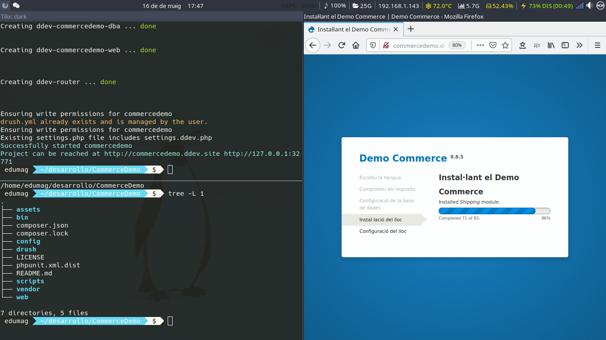

# Instalación de drupal con ddev



Hacemos una instalación demo de drupal commerce en local.

## Instalación de ddev

```bash
curl -L https://raw.githubusercontent.com/drud/ddev/master/scripts/install_ddev.sh | bash

cat /tmp/ddev_bash_completion.sh >> ~/.bashrc
```

## Iniciar proyecto drupal commerce

```bash
mkdir $SITE_NAME
cd $SITE_NAME
ddev config --docroot web --project-name $SITE_NAME --project-type drupal8
ddev start
ddev composer create drupalcommerce/demo-project -s dev  --no-interaction
drush sql-drop
drush cr
ddev restart
```

## Instalación desde el navegador

https://$SITE_NAME.ddev.site


## MailHog

http://$SITE_NAME.ddev.site:8025

## PhpMyAdmin

http://$SITE_NAME.ddev.site:8036/

## Referencias

- https://www.solucionex.com/blog/como-instalar-drupal-commerce-con-subtema-custom
- https://www.drupal.org/docs/official_docs/en/_local_development_guide.html

