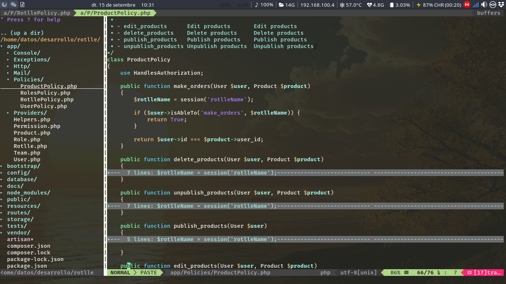

# Gestión de roles y permisos para grupos desde laravel con laratrust



Utilizamos el paquete laratrust para poder gestionar roles por grupos.

Roles por defecto:

-   Super admin superadmin
-   Vendor vendor
-   Admin group admin-group
-   User group user-group

Permisos:

-   delete\_products Delete products
-   publish\_products Publish products
-   unpublish\_products Unpublish products
-   make\_orders Make orders

Cada vez que asignamos un rol a un usuario tenemos que especificar el
grupo (rotlle), de esta manera un mismo usuario puede tener diferentes
roles en cada grupo.

Referencias:

-   <https://laratrust.santigarcor.me/docs/6.x/>

## Instalación

    composer require santigarcor/laratrust
    
    php artisan laratrust:setup
    
    composer dump-autoload
    
    php artisan migrate

## Configuración (config/laratrust.php):

En mi caso relaciono los equipos con los Rotlles :

```php
'models' => [

    'role' => AppRole::class,

    'permission' => AppPermission::class,

    /**
     * Will be used only if the teams functionality is enabled.
     */
    'team' => AppRotlle::class,
```

Activamos teams

```php
'teams' => [
    'enabled' => true,
    ...
```

## Desde las migraciones creamos el contenido por defecto

```php
class CreateInitContent extends Migration
{
    /**
     * Run the migrations.
     *
     * @return void
     */
    public function up()
    {
        // Create users default.
        User::create([
            'name' => 'Admin',
            'username' => 'admin',
            'email' => 'admin@example.com',
            'password' => bcrypt('admin')
        ]);

        // Demo rotlle.
        $this->copyImageDemo('demo-rotlle.jpg', public_path('images/rotlles'), public_path('images/demo/rotlles'));
        Rotlle::create([
            'name' => 'Demo Rotlle',
            'status' => 1,
            'description' => 'Demo group with demo content to allow to see the functionalities of the application.',
            'image' => 'demo-rotlle.jpg'
        ]);

        // User admin with rotlle demo.
        $admin = user::where('id',1)->first();
        $admin->rotlles()->attach(1);

        // Roles and permissions default.

        // Reset cached roles and permissions
        $this->truncateLaratrustTables();

        $roleAdmin = AppRole::firstOrCreate([
            'name' => 'superadmin',
            'display_name' => 'Super admin',
            'description' => 'All permissions'
        ]);

        // Create default permissions.
        $edit_products      = Permission::create(['name' => 'edit_products', 'display_name' => 'Edit products', 'description' => 'Edit products']);
        $delete_products    = Permission::create(['name' => 'delete_products', 'display_name' => 'Delete products', 'description' => 'Delete products']);
        $publish_products   = Permission::create(['name' => 'publish_products', 'display_name' => 'Publish products', 'description' => 'Publish products']);
        $unpublish_products = Permission::create(['name' => 'unpublish_products', 'display_name' => 'Unpublish products', 'description' => 'Unpublish products']);
        $make_orders        = Permission::create(['name' => 'make_orders', 'display_name' => 'Make orders', 'description' => 'Make orders']);

        // Create roles and assign existing permissions.
        $vendor = Role::create(['name' => 'vendor', 'display_name' => 'Vendor', 'description' => 'Vendor']);
        $vendor->syncPermissions([$edit_products, $delete_products, $unpublish_products]); 
        $admin_group = Role::create(['name' => 'admin-group', 'display_name' => 'Admin group', 'description' => 'Admin group']);
        $admin_group->syncPermissions([$publish_products, $unpublish_products, $make_orders, $edit_products, $delete_products]); 
        $user_group = Role::create(['name' => 'user-group', 'display_name' => 'User group', 'description' => 'User group']);
        $user_group->syncPermissions([$make_orders]); 

        // Assign roles to users.
        $adminUser = User::where('id',1)->first();
        $adminUser->attachRole($roleAdmin);
```

## Ejemplos de políticas

app/Policies/RotllePolicy.php

```php
public function make_orders()
{
    $rotlleName = session('rotlleName');

    if (auth()->user()->isAbleTo('make_orders', $rotlleName)) {
        return True;
    }
}
```

app/Policies/ProductPolicy.php

```php
public function publish_products(User $user)
{
    $rotlleName = session('rotlleName');

    if ($user->isAbleTo('publish_products', $rotlleName)) {
        return True;
    }

}
```

## Desde el controlador comprobamos permisos

```php
public function index(Rotlle $rotlle)
{

    $this->authorize('make_orders', $rotlle);
    $products = Product::paginate();

    return view('products.index', compact('products'));
}
```

## Desde la plantilla blade

```php+HTML
@can('edit_products', $product)
    <a href="{{ route('products.edit', $product->id) }}" 
    class="btn btn-sm btn-success">
        editar
    </a>
    <form style="display: inline;" action="{{ route('products.destroy', $product->id) }}" method="POST">
        @method('DELETE')
        @csrf
        <button class="btn btn-sm btn-danger">
            Eliminar
        </button>
    </form>
@endcan
```


```php+HTML
@can('publish_products', 'AppProduct')
<a style="float: right;" href="{{ route('products.create') }}" 
class="btn btn-sm btn-primary pull-right">
    Crear
</a>
@endcan
```
